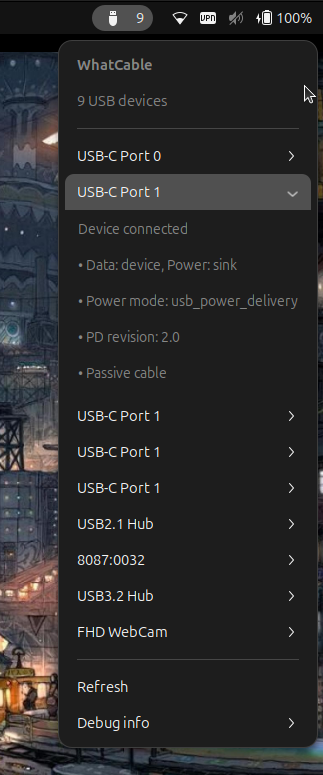

# WhatCable-GNOME

> **What can this USB cable actually do?**

A GNOME Shell extension that tells you what each USB device or USB-C cable plugged into your Linux machine can actually do.


**WhatCable-GNOME is a GNOME port of [WhatCable](https://github.com/darrylmorley/whatcable), a macOS menu bar app by [Darryl Morley](https://github.com/darrylmorley).** It expands the original USB-C focus to cover all USB devices, while preserving the rich USB-C Power Delivery diagnostics from the original.

The extension is a thin shell over the [`whatcable-linux`](https://github.com/Zetaphor/whatcable-linux) CLI, which does the actual sysfs reading and PD decoding.




## Quickstart

1. Install the `whatcable-linux` CLI from <https://github.com/Zetaphor/whatcable-linux> — the extension shells out to it.
2. Install the extension from <https://extensions.gnome.org/extension/9837/whatcable/>.
3. Click the panel icon to see what each connected USB device can do.

For manual install (build from source, system-wide, nested-shell testing) see [Install from source](#install-from-source) below.

The extension looks for `whatcable-linux` on `$PATH`, `/usr/local/bin`, or `/usr/bin`, and was last verified against `whatcable-linux 0.1.1` — the *Debug info* submenu shows installed vs known-good version so you can spot a mismatch.

## Install from source

Targets GNOME Shell 45–48.

```bash
cd gnome-extension
make install                                    # installs to ~/.local/share/gnome-shell/extensions/
# Restart GNOME Shell:
#   - Wayland: log out and log back in
#   - X11: Alt+F2, then type 'r' and press Enter
gnome-extensions enable whatcable@bjuergens.github.io
```

To install system-wide instead:

```bash
sudo make install-system
```

Or build a zip suitable for `gnome-extensions install` (the same zip we upload to extensions.gnome.org):

```bash
cd gnome-extension
make pack
gnome-extensions install --force whatcable@bjuergens.github.io.shell-extension.zip
```

### Quick local test

Rebuild + reinstall + start a nested GNOME Shell window with the new version:

```bash
cd gnome-extension && make install && cd .. && \
MUTTER_DEBUG_DUMMY_MODE_SPECS=1600x1000 dbus-run-session -- gnome-shell --nested --wayland
```

## How it works

WhatCable-GNOME is a pure-GJS panel indicator. It invokes `whatcable-linux --json` via `Gio.Subprocess` and renders each entry as a sub-menu with the device's headline, bullets, charging diagnostics, and (for chargers) the PDO list. Malformed entries degrade to a warning row.

All the real work — reading `/sys/bus/usb/devices/`, `/sys/class/typec/`, `/sys/class/usb_power_delivery/`, decoding PD VDOs, identifying charging bottlenecks — lives in the upstream CLI.

## Caveats

- **USB-C/PD data availability varies by hardware.** The Type-C connector class and USB PD sysfs interfaces depend on the kernel driver (UCSI, TCPM, platform-specific). Some systems expose full PD negotiation data; others expose only basic port info or nothing at all.
- **Cable e-marker info only appears for cables that carry one.** Same as the original — most USB-C cables under 60W are unmarked.
- **WhatCable trusts the e-marker.** Counterfeit or mis-flashed cables can lie about their capabilities.
- **Vendor name lookup is not exhaustive.** Common vendors are recognized; others show the hex VID.

## dev notes

### todo

* testing with many devices/cables
* testing with newer gnome versions
* compare with upstream and implement feature/ui/etc.

### release process

1. `make pack` — check for shexli warnings
2. push to main, then create release tag
3. wait for GHA release build, re-check shexli log
4. download zip from the release
5. upload at <https://extensions.gnome.org/upload/>

## Credits

WhatCable-GNOME is a port of [WhatCable](https://github.com/darrylmorley/whatcable) by [Darryl Morley](https://github.com/darrylmorley). The USB Power Delivery decoding logic, charging diagnostics, vendor database, and plain-English summary approach are derived from the original macOS app, via the [`whatcable-linux`](https://github.com/Zetaphor/whatcable-linux) CLI port.

## License

[MIT](LICENSE)
